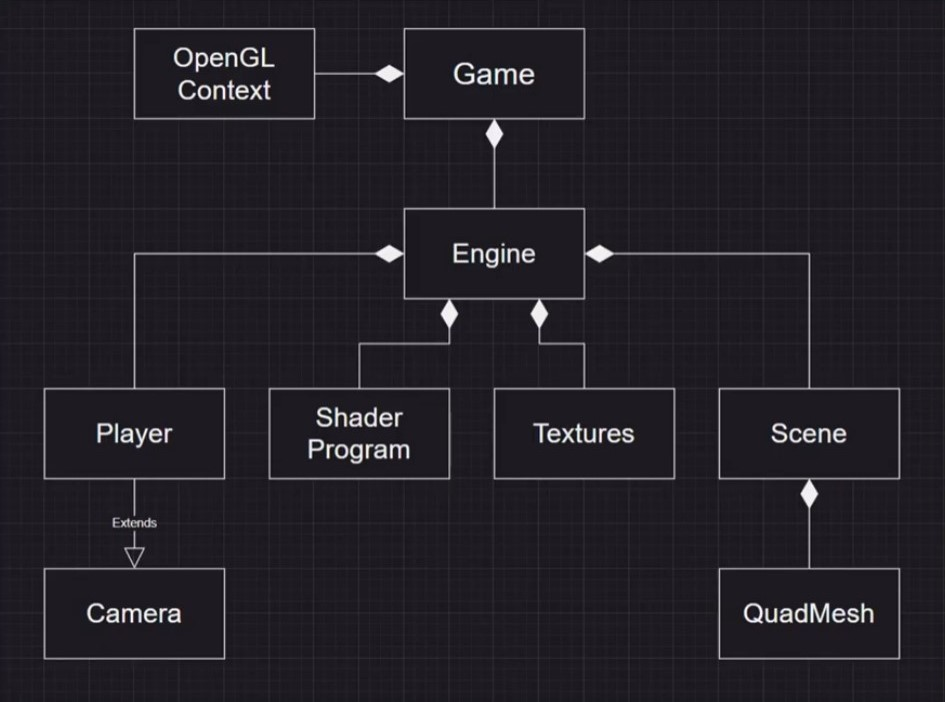
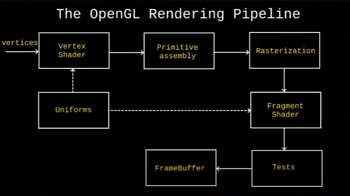

# OPENGL

- source: https://www.youtube.com/watch?v=Ab8TOSFfNp4

## Game Architecture



## OpenGl Rendering Pipeline:


## Formulas

#### base_mesh.py:
- VBO

```aiignore
in_postion
|<------->|
 ------ ------ ------ ------ ------ ------ ------ ------ ------
|  x1  |  y1  |  z1  |  x2  |  y2  |  z2  |  x3  |  y3  |  z3  |
 ------ ------ ------ ------ ------ ------ ------ ------ ------
```
```aiignore
 -----              ----------------
| VBO |            | Shader Program |
 -----              ----------------
        \         /
         &#8664;      &#8665;
           -----
          | VAO |
           -----
```


#### quad.vert:
```aiignore

 model                  world                  camera                  clip
 space     ----------   space    -----------   space    ------------   space
 -------> |  Model   | -------> |   View    | -------> | Projection | ------->
          | trasform |          | transform |          | transform  | 
           ----------            -----------            ------------
```


## HTML Entity / Symbols:
- &#x2666;
- &#9670;
- &#9660; 
- &#9650;
- &#8664;
- &#8665;
- `<`
- `>`